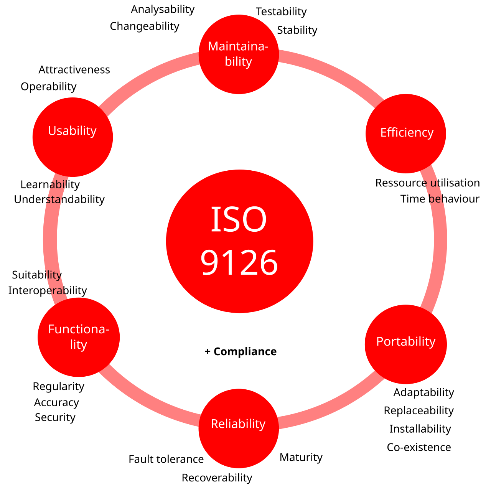
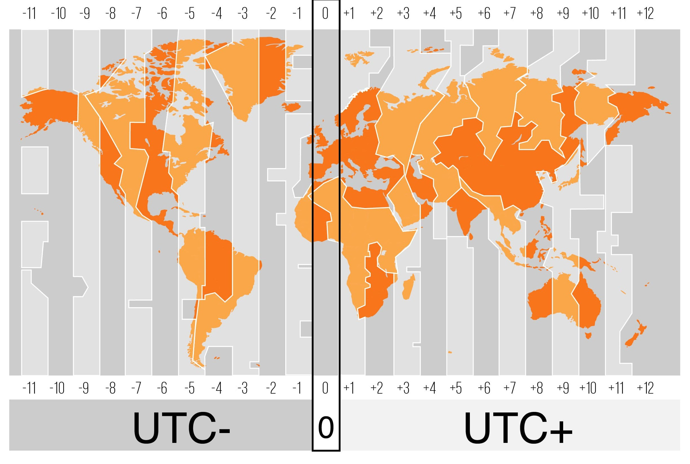
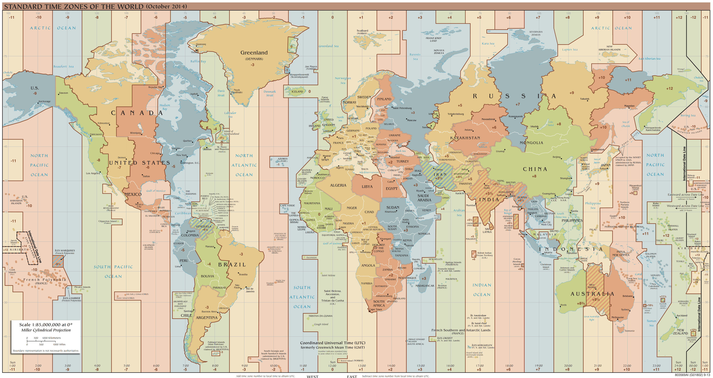
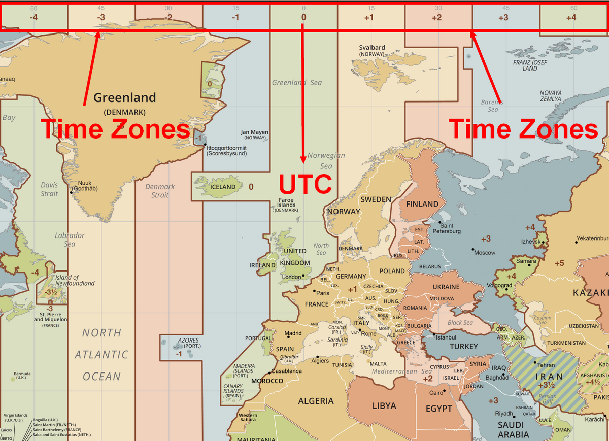

<div class="title-card">
    <h1>Time and date</h1>
</div>

---

# What you need to know

Warning. The `time and date` slide deck are extensive. 

You are not expecting to memorize everything but remember a couple examples that stand out to you for the exam.

Keep the rest as passive recall in case you encounter them in your future jobs.

Study the topic by looking at the learning goals in the semester plan and ensure that you can talk about the points such as its relevancy to SI.

If you only commit 1 thing to memory, let it be **ISO 8601**.

---

# Standards, standards, standards

<div ><div style="height:0;padding-bottom:75%;position:relative;"><iframe style="position:absolute;top:0;left:0;width:100%;height:100%;" frameBorder="0" src="https://imgflip.com/embed/9kho4b"></iframe></div>

---

# OpenAPI

Specification for documenting APIs.

---

# ISO/IEC 9126 - Standard for software quality



https://en.wikipedia.org/wiki/ISO/IEC_9126

---

# Base standards for software quality

ISO 9126 uses the following:

* **ISO 9001** Quality Systems: Model for Quality Assurance in Design/ Development, Production, Installation, and Servicing, International Organization for Standardization, Geneva, 1994.

* **ISO 8402** Quality Management and Quality Assurance: Vocabulary, International Organisation for Standardization, Geneva, 2nd Edition, 1994

---

<div class="title-card">
    <h1>Time representation</h1>
</div>

---

# How to Think About Time?

An interesting walkthrough of how to think about time by a Google developer worked on:

> The Java And Kotlin Ecosystem team at Google [that] has worked for several years to eliminate the sources of date/time bugs in Google’s codebase. We’ve learned a lot from this.

https://errorprone.info/docs/time

He represents time as instants, durations, datetime, periods and time zones.


---

# Time scales

* [Universal Time](https://en.wikipedia.org/wiki/Universal_Time): Based on the earth's rotation.

* [International atomic time (TAI)](https://en.wikipedia.org/wiki/International_Atomic_Time): Based on measurable physical phenomena as established by the 1967 General Conference on Weights and Measures (CGPM),

* [Coordinated Universal Time (UTC)](https://en.wikipedia.org/wiki/Coordinated_Universal_Time): Based on TAI but introduces leap seconds to keep it in sync with UT.

---

# What is this?

`2002-04-12T15:30:00Z`

1. *What month is it?*

2. *What is `T`?*

3. *What time zone it?*

4. *What does `Z` stand for?*


---

# The anatomy of ISO 8601

`2002-04-12T15:30:00Z`

1. April

2. Separator between date and time

3. UTC

4. Zulu time (NATO phonetic alphabet for Z)


---

# [ISO 8601](https://en.wikipedia.org/wiki/ISO_8601)

* Based on the Gregorian calendar.

* Can contain the date, time and timezone.

* Defines a singular format from the largest to smallest unit of time: year, month (or week), day, hour, minute, second, and fraction of second: `YYYY-MM-DDTHH:MM:SSZ`.

* Uses `T` to separate the date and time.

* Uses UTC if unspecified or `Z` is used.

* Is in local time if it contains an offset (from UTC): `YYYY-MM-DDTHH:MM:SS±HH:MM`.

* Hyphens and colons are used as separators but are optional.


---

# Timestamps: How about **now**?


* Date / time / date + time

* Zoned date / zoned time / zoned date + time

* Posix


---

# POSIX = Unix Epoch

*What is it?*

*Pros and cons?*

---

# Unix timestamp

Commonly known as Unix time/epoch, POSIX is the standardized definition.

* (-) You can't represent dates before 1970.

Depending on the use case and who you ask it could be either a pro or a con that:

* it doesn't take leap seconds into account. 

* it doesn't care about time zones, daylight saving time or anything else.

The above two points are what makes it different from UTC.

---

# UTC

UTC is a time standard that is based around the prime meridian (0° longitude).

GMT is the corresponding time zone.



[Source](https://24timezones.com/gmt-vs-utc)

---

# UTC map with correct time zones





[Source](https://militarytimechart.com/wp-content/uploads/2014/10/World-Time-Zones-Map.png)

---

<div class="title-card">
    <h1>Time in Javascript</h1>
</div>

---

# How can you define date and time in Javascript?

*Let's do it hands-on.*

---

# Javascript Date object

## Different date representations in Javascript

```javascript
console.log(new Date()); // Date Time in UTC

console.log(Date()); // Local Zoned Date Time

console.log(Date.now()); // Unix timestamp
```

## ISO 8601 formatted datetime in Javascript

```javascript
const date = new Date();

const danishDate = new Intl.DateTimeFormat("da-dk").format(date);
console.log(danishDate);

const americanDate = new Intl.DateTimeFormat("en-us").format(date);
console.log(americanDate);
```

---

# Javascript Temporal

An ECMAScript proposal for a new Date/Time API for JavaScript. Already in stage 3!

https://github.com/tc39/proposal-temporal

Could possibly look like this:

```javascript
const dateTime = Temporal.ZonedDateTime.from('2025-02-16T12:57:00+01:00[Europe/Paris]');
const dateTimeIso8601 = dateTime.toIsoString();

const now = Temporal.now.instant();
const today = now.day;
const tomorrow = today.add({ days: 1 });
const yesterday = today.subtract({ days: 1 });
```

https://tc39.es/proposal-temporal/docs/index.html

It aims to standardize [RFC 9557](https://datatracker.ietf.org/doc/rfc9557/)


---

<div class="title-card">
    <h1>Time zones and calendars</h1>
</div>

---

# Officially managed by IANA

There is a time zone database maintained by the Internet Assigned Numbers Authority (IANA):

https://www.iana.org/time-zones

---

# Hvad har EU med sommertid at gøre? 

> EU’s regler siger, at sommertid begynder klokken 01.00 (verdenstid – UTC) den sidste søndag i marts og ophører klokken 01.00 (verdenstid – UTC) den sidste søndag i oktober. 

> I marts 2019 traf et flertal i Europa-Parlamentet beslutning om, at de enkelte EU-lande inden april 2020 skulle afgøre deres stilling. Målet var, at skift mellem sommer- og vintertid (korrekt kaldet normaltid) skulle ophøre i 2021.

> Dette er dog endnu ikke sket. Ministerrådet har nemlig vist sig ikke at være enige med Europa-Parlamentet. I hvert fald er det ikke lykkedes at nå frem til en fælles position, og de enkelte medlemslande præges også af delte meninger. Emnet er heller ikke på dagsordenen i Kommissionens seneste reviderede arbejdsprogram.

https://www.eu.dk/da/faq/alle-faqs/hvad-har-eu-med-sommertid-at-goere

*What does summertime have to do with system integration?*

---

# Examples of differing time zones

Discuss in pairs: *Examples of differing time zones in different systems that integrate with each other*

---

# Calendars

| Calendar | Calendar | Calendar |
|----------|----------|----------|
| Buddhist  | Chinese  | Coptic  |
| Dangi    | Ethioaa | Ethiopic |
| Gregory  | Hebrew  | Indian  |
| Islamic  | Islamic-umalqura | Islamic-tbla |
| Islamic-civil | Islamic-rgsa | Japanese |
| Persian  | ROC     |         |

ISO 8601 adopts the Gregorian calendar as the standard.

---

<div class="title-card">
    <h1>Quirks about time</h1>
</div>

---

# Question: Time formatting and storage bugs

*What formatting and storage bugs have you heard about?*


---

# Time formatting and storage bugs

**Y2K**

Some systems had represented year with 2 digits. Fear that 99 –> 00. 

**Y2038**

If dates are stored in signed 32-bit integers. −(231) and 231 − 1 then…
we will exhaust all seconds on 2038 since Unix epoch which starts at 00:00:00 UTC on 1 January 1970. 

The fix: 64-bit integers won’t overflow until 292 billion years. 

There are other types of bugs listed here:

https://en.wikipedia.org/wiki/Time_formatting_and_storage_bugs


---

# Edge cases with time and time zones


*Can you think of any edge cases with time and date?*

---

# The Problem with Time & Timezones - Computerphile

[](https://www.youtube.com/watch?v=-5wpm-gesOY)


---

# AM / PM

| Hour (24-hour)| Hour (12-hour)|
|---------------|---------------|
| 0             | 12 AM         |
| 1–11          | 1–11 AM       |
| 12            | 12 PM         |
| 13–23         | 1–11 PM       |

---

# Leap Seconds

https://en.wikipedia.org/wiki/Leap_second

Because of the need for negative leap seconds, it has been [voted to abolish leap seconds in 2035](https://phys.org/news/2022-11-global-timekeepers-vote-scrap.html). But if the drift grows to large they might introduce a leap "minute" or other unspecified large duration.

How to solve leap seconds:

1. Traditional: It is decided that at a certain time all clocks must be put forward or back by one second.

2. [Smearing](https://developers.google.com/time/smear): The leap second is spread out over a longer period of time.


---

<div class="title-card">
    <h1>Time in Python</h1>
</div>

---

# Python datetime examples:

```python
# import datetime
# print(datetime.datetime)

from datetime import datetime

current_datetime = datetime.now()

print(current_datetime)

print(datetime.now().strftime('%Y-%m-%d %H:%M:%S'))
```

---


<div class="title-card">
    <h1>Time and System Integration</h1>
</div>

---

# Date / time mismatch and the implications when integrating systems 

Discuss in pairs:

*How can a mismatch in time zones affect how date/time is displayed or stored?*

---

# High-level overview of time and date mismatch affecting SI

## The **client**'s time zone differs from the **server**:

1. When storing the date / time.

2. When displaying the date / time.


## A **server**'s time zone differs from another **server**:

1. Logs, Messages or other chronologically structured data ends up out of order.

2. In event-driven systems, retracability is ruined because of "time travel".

3. A distributed database saves incorrect timestamps.

---

# Some concrete examples of time and date mismatch problems

## The start of a **duration** is in a different time zone than the end:

1. An internal time management system where workers check into work and check out. Could cause wage theft.
2. A ride-sharing app logs a trip across time zones. Could potentially end in a negative fare if mishandled.
3. A flight booking system showing shorter or longer travel times. 

## Time-sensitive **timestamp**:

1. A customer uses a time-limited coupon that expires at midnight. What if they are in a different time zone?
2. A user cancels a subscription. Depending on the time zone, they might be charged for an extra month.
3. An online learning platform might show incorrect deadlines or close for submission to students in other time zones. 


