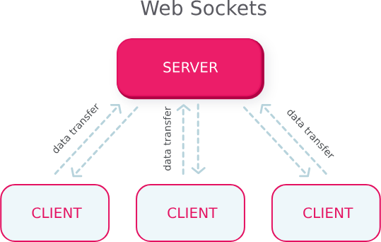
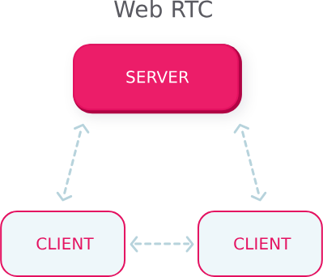
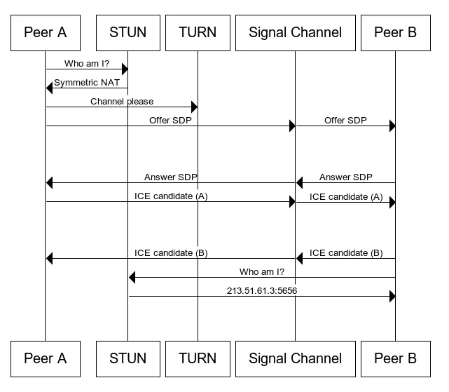
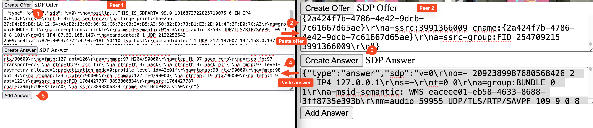

<div class="title-card">
    <h1>Client to client</h1>
</div>

---

# Peer-To-Peer (P2P)

*Suggestions?*

---

# [BitTorrent](https://en.wikipedia.org/wiki/BitTorrent) - Terminology I

**Tracker**: A server that keeps track of peers participating in a torrent swarm.

**Swarm**: The group of peers participating in a torrent.

**Torrent file**: Contains metadata about the content, piece hashes for validation and optionally the tracker URL.

**Block**: The smallest unit of data that can be requested from a peer. Enables parallel downloading out of order.

---

# BitTorrent - Terminology II

## Each client has a:

**Peer set**: List of peers.

**Active peer set**: A subset of the peer set that includes peers the client is actively exchanging data with. Limits the number of simultaneous connections.

## Two types of peers:

**Leecher**: When a peer is downloading.

  - (In common parlance, leecher is often used as a derogatory term for someone who downloads without uploading, often by not sharing after their download is complete.)

**Seeders**: When a peer has all the pieces of the content.

---

<div class="title-card">
    <h1>WebRTC</h1>
</div>

---

# About Browsers

Supported programming languages: JavaScript, WebAssembly

Supported protocols:

| Protocol     | Directionality            | Statefulness |
|-------------|---------------------------|-------------|
| HTTP (fetch, forms) | Unidirectional           | Stateless   |
| SSE (Server-Sent Events)  | Unidirectional           | Stateful    |
| WebSocket                 | Bidirectional            | Stateful    |
| WebTransport              | Bidirectional            | Stateful    |
| WebRTC                    | Bidirectional/unidirectional | Stateful    |
| QUIC                      | Multiplexed, bidirectional | Stateful    |


---

# WebRTC

As opposed to BitTorrent, which establishes a peer-to-peer file-sharing **network**, WebRTC enables real-time communication in web browsers.

RTC = Real-Time Communication

Works in all [modern browsers](https://caniuse.com/rtcpeerconnection).

Types of streams:

1. Audio

2. Video

3. Data (text, binary) - for chat, file transfer, etc.


---

# WebSocket vs. WebRTC

## Underlying Network Protocol

* WebSocket uses TCP. 

* WebRTC uses UDP for media and SCTP for data channels.

## Communication

* WebSocket requires a server to relay messages between clients.

* WebRTC allows clients to communicate directly.

WebRTC requires clients to exchange metadata in order to establish a connection. In principle, this could be done without any servers. In practice, a server is used to pair clients. 

---

# WebSocket vs. WebRTC Architecture

<div style="display: flex; align-items: center;">
	
	
</div>

[Source](https://requestum.com/blog/webrtc-vs-websockets)


---

# Signalling

1. First peer creates an offer in the form of an [SDP object](https://en.wikipedia.org/wiki/Session_Description_Protocol#Session_description) (Session Description Protocol).

2. The offer is sent to the second peer. This is done through a signaling server.

3. The second peer creates an answer in the form of an SDP object.

4. The answer is sent back to the first peer.

5. The first peer and the second peer now have a direct connection.

---

# ICE (Interactive Connectivity Establishment)

Because of NATs and firewalls, direct connections are not always possible.

ICE is a technique to overcome this. 

It works by sending a list of possible IP addresses and ports to the other peer.

This list is called ICE candidates.

To get the potential candidates a client can make a series of requests to a STUN / TURN server.

There are many STUN servers available for free. Google's STUN server is a popular choice.

---

# Existing STUN servers

Good news! We don't have to implement our own STUN server. Many are available for free.

[List of STUN servers](https://gist.github.com/zziuni/3741933)

Websites to test STUN and TURN servers work: [1](https://icetest.info/) and [2](https://webrtc.github.io/samples/src/content/peerconnection/trickle-ice/).

Snippet for Google's STUN servers:

```javascript
const servers = {
	iceServers: [
		{
			urls: [
				"stun:stun.l.google.com:19302",
				"stun:stun1.l.google.com:19302",
			],
		},
  ],
};
```

---

# WebRTC Protocol



[Source](https://medium.com/swlh/manage-dynamic-multi-peer-connections-in-webrtc-3ff4e10f75b7)

---

<div class="title-card">
    <h1>Hands-on WebRTC</h1>
</div>

---

# First example - Exemplify the offering process

We will create the SDP objects and show them in the DOM. Then we will require the SDP to be copied to the other peer.

Flow:

1. Local peer creates an offer.

2. Remove peer copies the offer in the SDP Offer text area and creates an answer.

3. Local peer copies the answer in the SDP Answer text area and hits `Add Answer`.

---

# SDP browser offer / answer flow



---


<div class="title-card">
    <h1>Using Firestore as a signalling server</h1>
</div>

---

# Why Firestore?

* It is hosted and always running (as opposed to Vercel which is serverless)

* It requires no code to setup and little to integrate with

* It is free and doesn't require a credit card to sign up

And the most important requirement for a signaling server:

* Allows us to get real-time updates when a new offer, answer or new ICE candidates need to be exchanged.

---

# Initialize the project with Vite

Create a vanilla JS project.


```bash
$ npm init @vitejs/app
# OR
$ npm create vite@latest <project_name>
```

---

# Create a Firestore database


1. Created a Firebase project: https://console.firebase.google.com/

2. In the Firebase Console choose **Create a Firebase project**

3. Once created go to **Build > Firestore Database**.

4. Click **Create Database**.

5. [Optional]: Select `eur3 (Europe)` as the Location. Click **Next**.

6. Choose `Start in test mode` and click **Create**.


---

# Register a Web App

1. In the **Project Overview**, click the **</>** (Web) icon under **Get started by adding Firebase to your app**.

2. Enter a name for your app and click **Register app** (Firebase Hosting is not needed).

3. Get the firebaseConfig object.

4. Click **Continue to the console**.

---

# Connect to Firebase in your code

Install the Firebase SDK:

```bash
$ npm install firebase
```

Delete everything in `src/main.js` and import the css file from your Javascript file (Vite will bundle it with your HTML):

```javascript
import './style.css';
```
Next, import and initialize Firebase:

---

# Connecting to Firestore - Beware of outdated code

<!-- [](https://www.youtube.com/watch?v=WmR9IMUD_CY) -->

Note that a change has beeen made to the library and you must import the compat version of Firestore in order to use dot notation for querying.

```javascript
import firebase from "firebase/compat/app";
import "firebase/compat/firestore";

const app = firebase.initializeApp(firebaseConfig);
const firestore = firebase.firestore();
```


---

<div class="title-card">
    <h1>More possibilities with WebRTC</h1>
</div>

---

# Multiple peers

Making it work for multiple peers is not trivial.

You would need to share the offer with all peers and then get the answer from all peers.

Beware that resources try to tell you that it is easy but they never offer a full, true multiple peer solution.

---

# Sending files over WebRTC

Since WebRTC supports data channels, it is possible to send files between browsers.

Rather than UDP, WebRTC data channels uses SCTP (Stream Control Transmission Protocol) which are **reliable and ordered by default**.

But data channels can be configured to be unreliable and unordered:

```javascript
const dataChannel = peerConnection.createDataChannel("channel", {
  ordered: false,
  maxRetransmits: 3
});
```

Remember: The default is that the transmission is reliable and ordered. Nothing has to be specified for that.

Similar to TCP, SCTP has error correction (checksum validation) and congestion control (slow start, fast retransmit).

---

# Chunking files

Because of size limitations, transfers will fail for large files.

The solution is to chunk the file (buffer) and send the parts:

```javascript
      const chunkSize = 16 * 1024;

      while (buffer.byteLength) {
        const chunk = buffer.slice(0, chunkSize);
        buffer = buffer.slice(chunkSize, buffer.byteLength);

        dataChannel.send(chunk);
      }
```

Additional tip: Create a **start event** that contains the filename and extension and create a **finish event** to signal the end of the file and for the peer to download the file.

---

# Screensharing

Instead of getting the webcam (what we've done):

```javascript
    localStream = await navigator.mediaDevices.getUserMedia({ video: true, audio: true });
```

You can get the user's screen by using `getDisplayMedia` this:

```javascript
    localStream = await navigator.mediaDevices.getDisplayMedia({ video: true});
```

---

# Pros and cons of using WebRTC

*Can you think of pros and cons of using WebRTC?*

---

# Pros and cons

* (+) Faster: since it sends the data directly to the peer. 

* (+) More private: in cases where you trust the peer and not the company providing the service.

* (+) High-quality media transmission: uses Opus (audio) and VP8, VP9, H.264 (video).

* (+) Built-in optimizations: includes adaptive bitrate, echo cancellation, noise suppression for better media quality.

* (-) Complex setup: requires signaling, NAT traversal (ICE/STUN/TURN) and peer discovery.

* (-) Not always possible: depending on NAT or firewall policies.

* (-) Difficult to handle edge cases: implementing fallbacks, reconnections and handling different device capabilities.


---

# WebRTC solutions for developers

Since WebRTC is tricky to get right, solutions for developers exist.

- **Saas services**: Twilio, Agora, etc. 

- **SDKs**: [Video SDK](https://www.videosdk.live/), [Flashphoner](https://github.com/flashphoner/flashphoner_client)


---


<div class="title-card">
    <h1>Other communication</h1>
</div>

---

# Other communication

* Bluetooth

* RFID: For identification. 

* NFC: For communication. 


