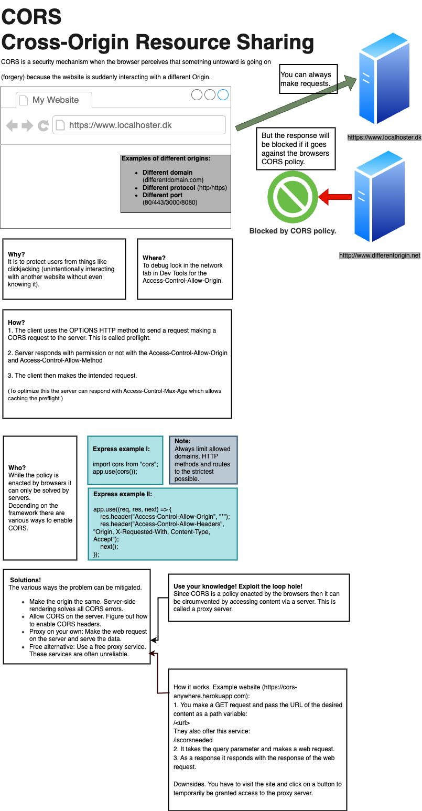

<div class="title-card">
    <h1>CORS</h1>
</div>

---

# Let's create an example

1. Create an `index.html` file with this and open it in your browser:

    ```html
    <h2>Timestamp from Express</h2>
    <p id="timestamp-express"></p>
    ```

2. And in a script tag, add this:

    ```javascript
    fetch("http://localhost:8080/timestamp")
    .then((response) => response.json())
    .then((result) => {
        const timestampExpressParagraph = document.getElementById("timestamp-express");
        timestampExpressParagraph.textContent = result.time;
    });
    ```

3. Set up a simple Express server and create the following route:

    ```javascript
    app.get("/timestamp", cors(), (req, res) => {
        res.send({ time: new Date() });
    });
    ```

*What happens? What is the problem*

---

# History

Drafted in 2006 by the World Wide Web Consortium (W3C) and recommended in 2014.

Intended as a security featureby restricting how web pages can request resources from different origins.


---

# Same-origin policy

* **Origin**: protocol, domain, and port.

Browsers allow websites to make requests freely to the same origin but not to different origins.


---

# Headers

`Access-Control-Allow-Origin: <origin>` 

`Access-Control-Allow-Methods: <methods>`

`Access-Control-Allow-Headers: <headers>` (for preflight requests to show what headers are supported for future requests)


---

# Preflight requests

A preflight request is an `OPTIONS` request sent by the browser to check if the server allows the actual request.

For example, making the following request will respond with the headers which reveal that the server allows the request:

```text
OPTIONS /api/data HTTP/1.1
Origin: https://example.com
Access-Control-Request-Method: POST
Access-Control-Request-Headers: Content-Type
```

While preflighting is inefficient, the server can respond with `Access-Control-Max-Age: <seconds>` to allow the browser to cache the preflight response for a certain amount of time.

For [simple requests](https://auth0.com/blog/cors-tutorial-a-guide-to-cross-origin-resource-sharing/#Understanding-CORS-Request-Types), the browser will send the request directly without a preflight check. There are a set of conditions such as simple requests being one of type [`GET`, `POST`, or `HEAD`](https://fetch.spec.whatwg.org/#cors-safelisted-request-header) and more. 

---

# Preflighted request - MDN Example


[Source](https://developer.mozilla.org/en-US/docs/Web/HTTP/Guides/CORS#preflighted_requests)

---

# Let's set up an Express server and make a preflight request

1. Set up a simple Express server.

2. Make a `OPTIONS` request to our backend with Postman. 

*What happens and why?*

---

# The preflight request fails

To solve it, let's try to setup CORS.

Try to make a `OPTIONS` request with Postman again.

---

# CORS Debugging via response headers (Network Tab / Postman)

For security reasons, browsers are intentionally obtuse about what went wrong.


| Error                                        | Cause                                                 | Solution                                                                                     |
|----------------------------------------------|-------------------------------------------------------|----------------------------------------------------------------------------------------------|
| **No 'Access-Control-Allow-Origin' header**  | Server did not include CORS headers                   | Set `Access-Control-Allow-Origin` in the response to match the request origin                |
| **Method not allowed**                       | Server blocks the HTTP method used                    | Set `Access-Control-Allow-Methods` to include the required HTTP verb                         |
| **Origin not allowed**                       | Server blocks the request origin                      | Set `Access-Control-Allow-Origin` to the origin or allow all with `*`                        |
| **Credential not allowed**                   | Request includes credentials, but server blocks them  | Set `Access-Control-Allow-Credentials: true` and avoid `*` for `Access-Control-Allow-Origin` |

---

# Advice: Limit access control

* Only allow trusted origins. If the frontend is on a different origin, then configure it so only the frontend can access the server.

> Avoid using wildcards in internal networks. Trusting network configuration alone to protect internal resources is not sufficient when internal browsers can access untrusted external domains. 

[Source](https://portswigger.net/web-security/cors#what-is-cors-cross-origin-resource-sharing)

* Using wildcards have their place

> A wildcard same-origin policy is appropriate when a page or API response is intended to be accessible to any code on any site. A freely available web font on a public hosting service like Google Fonts is an example.

[Source - Wikipedia](https://en.wikipedia.org/wiki/Cross-origin_resource_sharing)

It is clear in the above example that Google Font cannot know which sites will use the font. Besides, there is no danger to them if they do.

---

# CORS is not a substitute for server-side security policies

> CORS defines browser behaviors and is never a replacement for server-side protection of sensitive data - an attacker can directly forge a request from any trusted origin. Therefore, web servers should continue to apply protections over sensitive data, such as authentication and session management, in addition to properly configured CORS. 

[Source](https://portswigger.net/web-security/cors#what-is-cors-cross-origin-resource-sharing)


---

# CORS infographic



