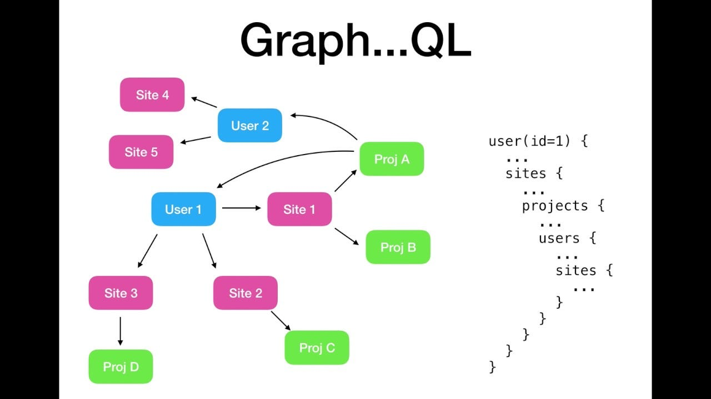

<div class="title-card" style="color: cyan;">
    <h1>GraphQL</h1>
</div>

---

# History

- Developed by Facebook in 2012.

- Open-sourced in 2015.


---

# GraphQL

**QL**: A query language for APIs. 

**Graph**: Data is seen as graphs. 



[Image source](https://medium.com/quick-code/top-online-video-tutorials-to-learn-graphql-458056e3b583)


---

# Problem 1: The Update Problem Again

How do you update the client when a change happens on the server?

There are **3 operation types** of operations in GraphQL:

1. **Query**: Fetch data.

2. **Mutation**: Change data.

3. **Subscription**: Real-time data.

The subscription type aims to solve this problem. 

---

# What protocol does Subscription use?

Since GraphQL is a specification, it depends on the implementation. Here are some possibilities:

* WebSocket.

* Server-Sent Events (SSE) [Source](https://graphql.org/learn/subscriptions/).

* HTTP Multipart: `multipart/mixed` which is a server-to-client streaming protocol in HTTP that we haven't talked about.

* Custom transport protocol: Socket.io for example.

---

# Problem 2: Over-fetching and Under-fetching

[](https://www.youtube.com/watch?v=eIQh02xuVw4)


---

# Where is GraphQL a good idea?

## Company types:

1. Large companies with separate backend and frontend teams. 

2. Public facing APIs (e.g. Github) that need to be flexible, have strong typing and documentation. 

## Application types:

1. Mobile applications: that have constraint of variable network conditions.

2. Microservices architecture: GraphQL can be a gateway to multiple services.

3. Real-time applications: Subscription operation. 


---

# When is GraphQL not the ideal choice?

1. Granular control over authorization is needed.

2. HTTP caching is important (CDNs, Proxies, Web Servers). Since GraphQL serves over a single endpoint: POST `/graphql`.

3. File uploads are needed.

---

<div class="title-card" style="color: cyan;">
    <h1>Hands-on: Github</h1>
</div>

---

# Github GraphQL API

Search for `Github GraphQL API Explorer`. 

https://docs.github.com/en/graphql/overview/explorer

Useful commands:

- **Autocomplete**:  
  - Mac: `Option + Space` or `Shift + Space`  
  - Windows: `Ctrl + Space` or `Shift + Space`

- **Run query**:  
  - Mac: `Cmd + Enter`  
  - Windows: `Ctrl + Enter`


<!-- Inspired by: https://www.youtube.com/watch?v=B4rY2rgn1RY -->

---

# Github GraphQL API - Basic query

When doing Query operation you can omit the `query` keyword and just start with curly brace:

```graphql
{
  viewer {
    login
    name
    bio
    repositories(first: 5) {
      nodes {
        name
        description
      }
    }
  }
}
```

---


# Github GraphQL API - Login

You can get multiple datasets at once but you must label (`<label_name>:`) them to differentiate:

```graphql
{
  me: user(login: "anderslatif") {
    avatarUrl
  }
  user(login: "joneikholmkea") {
   id
  }
}
```

---

# Github GraphQL API - Fragments

```graphql
{
  me: user(login: "anderslatif") {
    ...UserFragment
  }
  user(login: "joneikholmkea") {
   ...UserFragment
    company
  }
}

fragment UserFragment on User {
    id
    avatarUrl
}
```

---

# Github GraphQL API - Variables

Click on `Variables` and define the query variables:

```json
{
  "myUser": "anderslatif"
}
```

Use the variable in the query (invoke it with `$`). Also, you must name the query and pass the variable as a parameter:

```graphql
query getMyProfile($myUser: String!) {
  user(login: $myUser) {
    avatarUrl
  }
}
```

Remember to make the String required with `!`. 

---

# Github GraphQL API - Search

```graphql
{
  search (first: 10, query: "kea", type: REPOSITORY) {
    nodes {
      ... on Issue {
        author {
          login
        }
      }
			... on Repository {
        name
        nameWithOwner
      }
    }
  }
}
```

---

<div class="title-card" style="color: cyan;">
    <h1>Implementing GraphQL</h1>
</div>

---

# Two ways to define the schema


1. **Code-first**: Define the schema in code.

2. **Schema-first**: Define the schema in a schema definition language (SDL).


---

# Javascript

Apollo has long been the go-to library for GraphQL in Javascript.

[Apollo Server (Node.js)](https://www.apollographql.com/docs/apollo-server/getting-started/)

[Apollo Client (React)](https://www.apollographql.com/docs/react/)

But lately, companies are choosing other libraries.

---

# Python

https://fastapi.tiangolo.com/how-to/graphql/

## Code-first approaches:

[Strawberry](https://strawberry.rocks/)

## Schema-first approach:

[Graphene](https://graphene-python.org/)

[Ariadne](https://ariadnegraphql.org/)

Through research and trying out all three libraries, I recommend `Ariadne` for Python.

Code-first makes sense at a surface level but GraphQL as a schema gives flexibility and reusability.

---


<div class="title-card" style="color: cyan;">
    <h1>Hands-on with frontend</h1>
</div>

---

# Backend

Install `express` and `graphql` and use their hello world schema example:

https://www.npmjs.com/package/graphql-http


---

# Frontend

Libraries like Apollo exist for frontend but without using any libraries you can always query the GraphQL API with `fetch`:

```javascript
fetch("/graphql", {
    method: "POST",
    body: JSON.stringify({
        query: helloQuery
    }),
    headers: {
        "Content-Type": "application/json"
    }
})
```

---

<div class="title-card" style="color: cyan;">
    <h1>Let's have a look at some bigger projects</h1>
</div>

