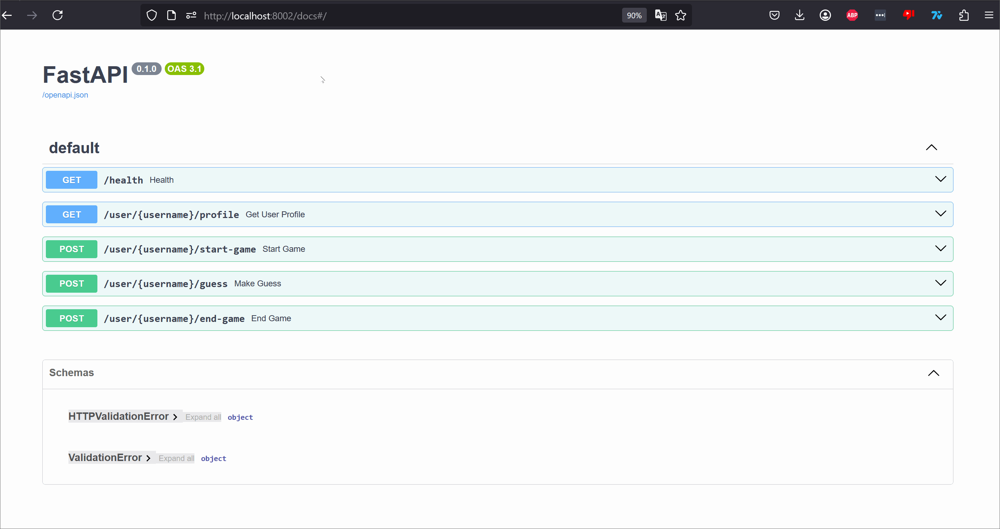
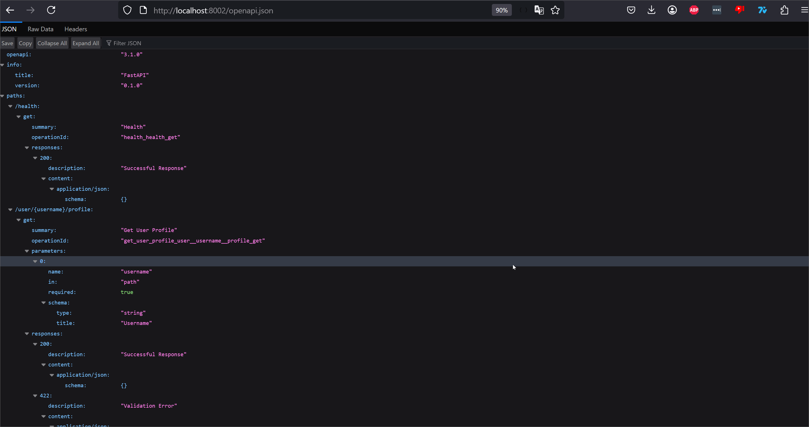

# OpenAPI REST API Documentation

For each microservice in our system we have a seperate FastAPI app setup, running on different ports. 
When we create a FastAPI app, it automatically generates an OpenAPI schema and serves it in 2 ways.

1. Interactive docs with Swagger UI:
`http://localhost:8000/docs`

3. Raw OpenAPI JSON:
`http://localhost:8000/openapi.json`

To access the documentation for each service, we enter the correct port and can then see the REST API documentation.
