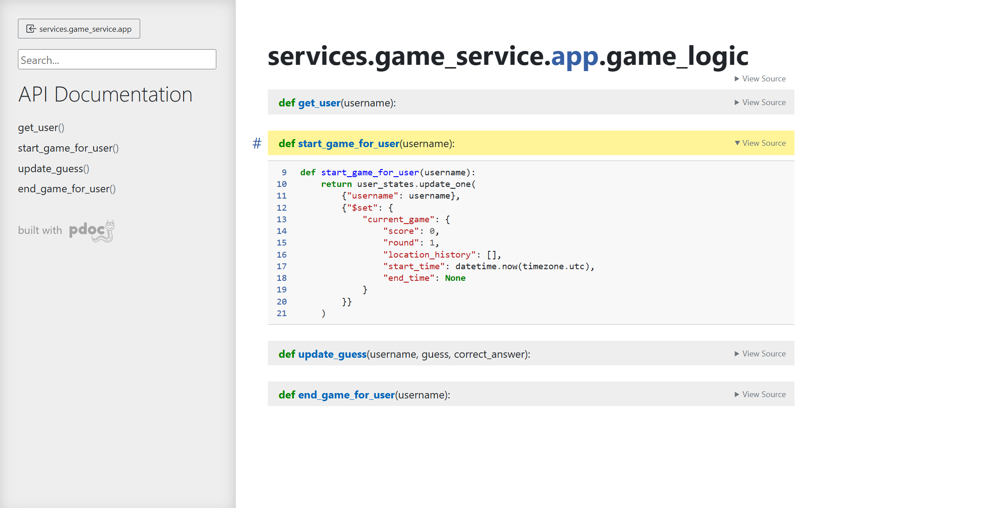
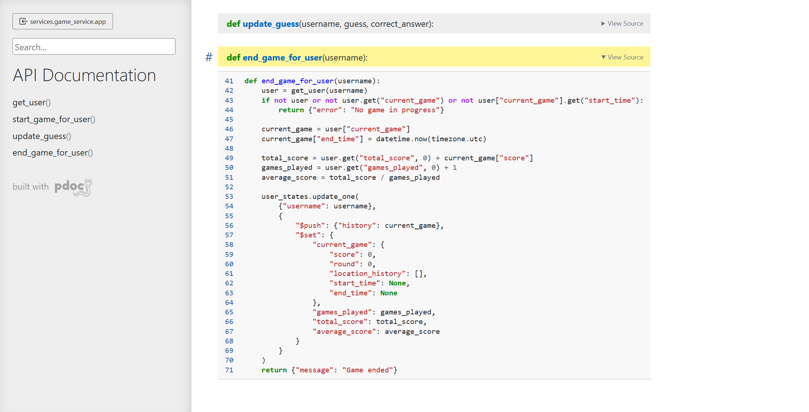
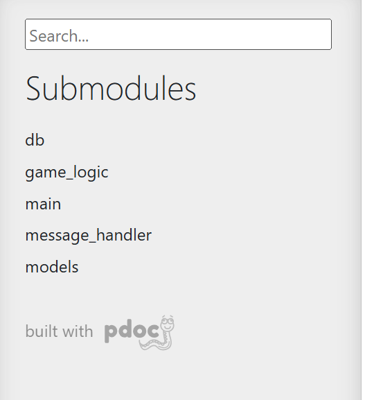
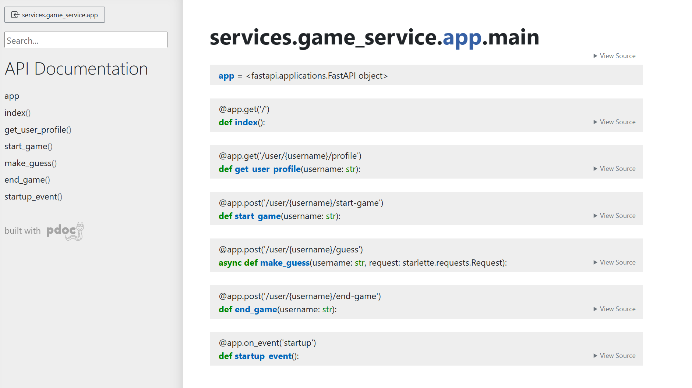
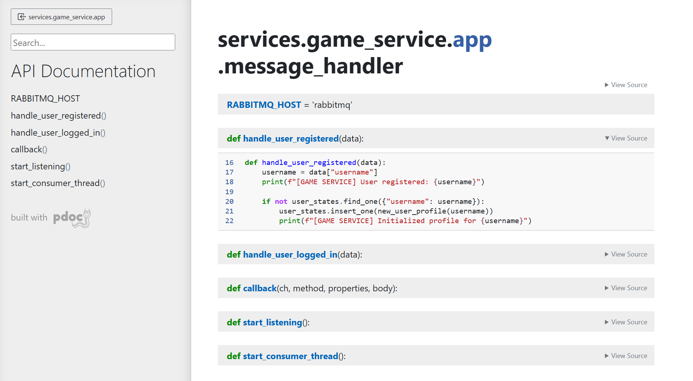

# DLS Group - Code Documentation Setup

This project uses [pdoc](https://pdoc.dev/) to generate documentation for the Python backend.

We chose to document the `game_service` microservice (running on FastAPI) because it contains core functionality such as:
- Game start and end logic
- Guess validation
- MongoDB communication
- RabbitMQ message handling

## How to regenerate documentation

From the project root:

1. Make sure you're in the virtual environment:
   > .venv\Scripts\activate

2. Run pdoc with this command:
   > python -m pdoc services.game_service.app --output-dir docs

This creates HTML files in the `docs/` folder which can be opened directly in the browser.

## Screenshots

